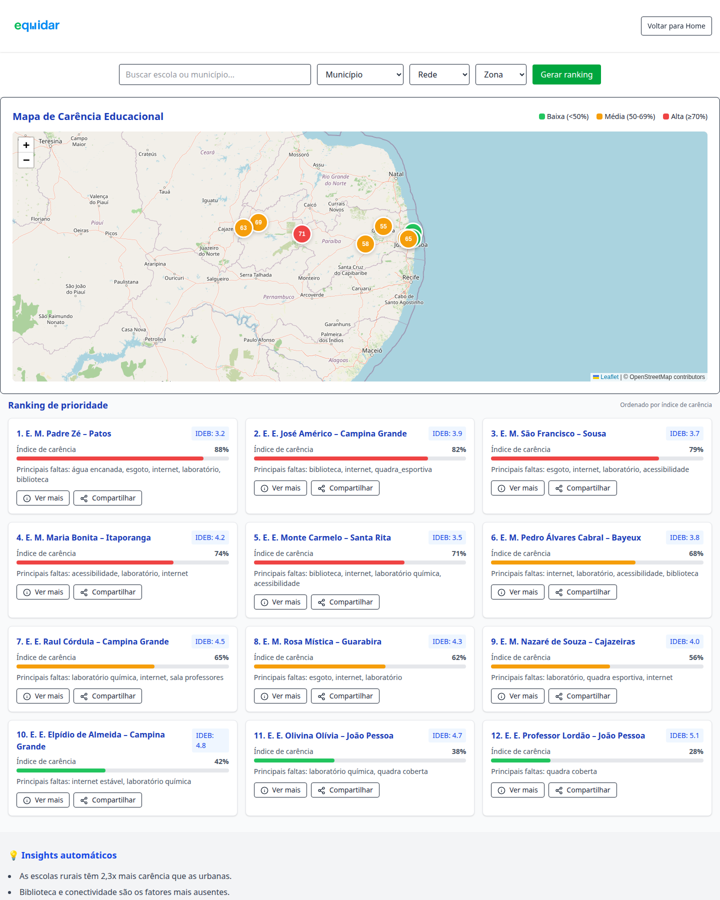
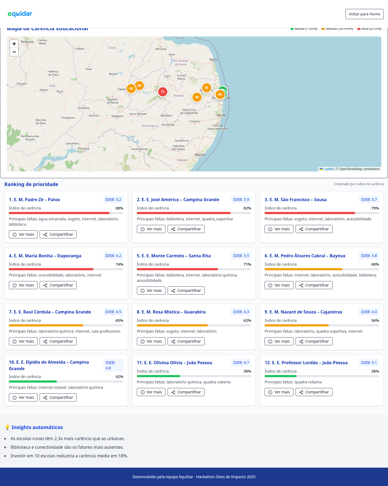
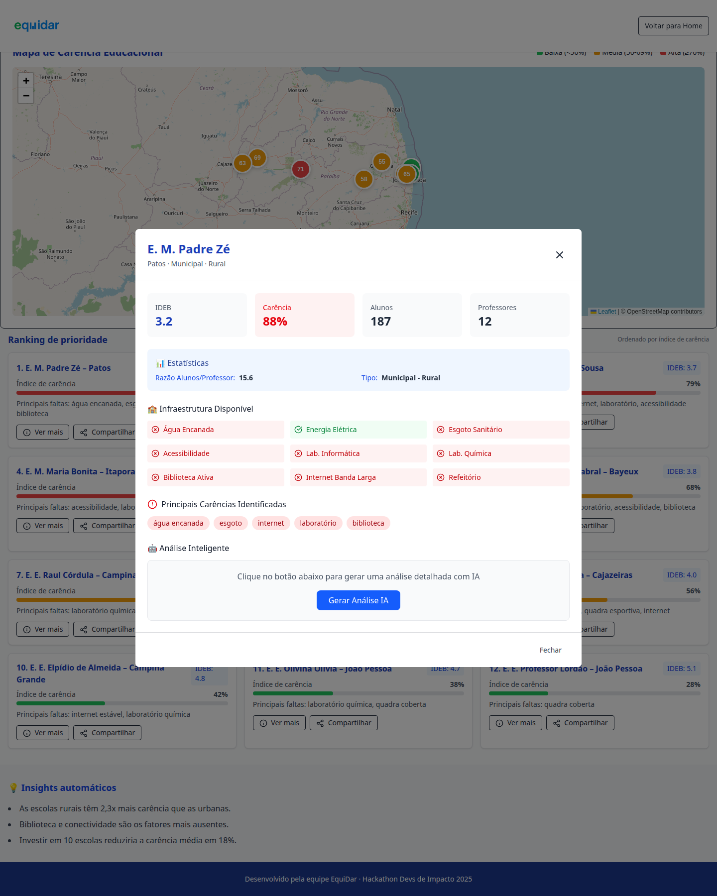
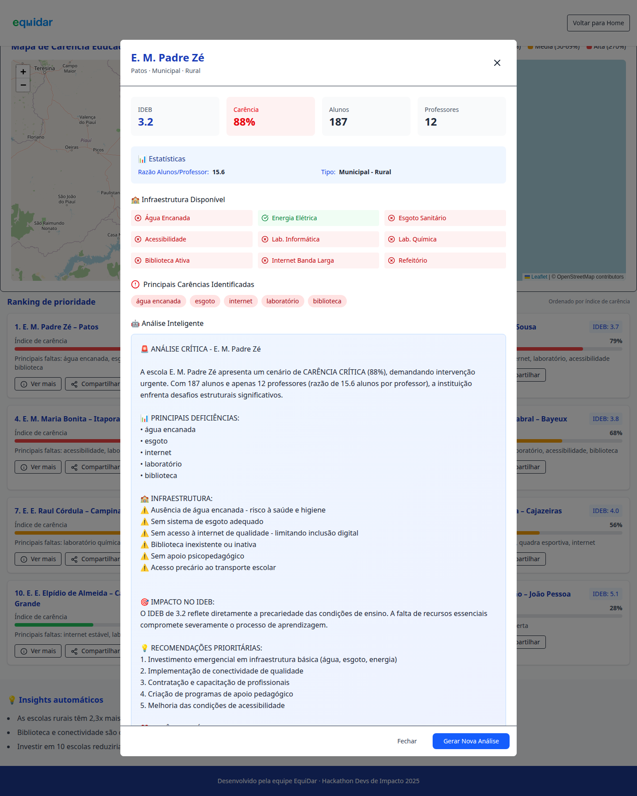

<p align="center">
  
</p>

# Equidar

Equidar é uma plataforma de apoio à decisão para educação pública, criada para ajudar gestores a identificar escolas e municípios com maior carência de infraestrutura e desempenho educacional.

O projeto combina dados de IDEB e infraestrutura escolar para transformar indicadores em sinais de prioridade mais transparentes e acionáveis.

## Objetivo

- Tornar a priorização de investimentos educacionais mais justa e orientada por dados.
- Evidenciar onde estão os maiores gargalos de infraestrutura e aprendizagem.
- Apoiar decisões de política pública com visualizações simples e narrativas explicáveis.

## Fluxo principal da aplicação

### 1) Entrada e proposta de valor
Tela inicial com posicionamento do problema e chamada para ação.


### 2) Explicação de como a plataforma funciona
Seção com os pilares: transparência, IA para priorização e mensuração de impacto.


### 3) Exploração territorial de carência
Mapa com municípios e faixas visuais de carência educacional.



### 4) Ranking de escolas prioritárias
Lista ordenada por índice de carência, com destaques de IDEB e faltas principais.



### 5) Detalhamento de escola
Modal com indicadores da escola, infraestrutura disponível e carências críticas.



### 6) Análise inteligente da escola
Geração de análise textual contextual para apoiar tomada de decisão.



## Arquitetura resumida

- Frontend: React + TypeScript + Vite + Tailwind + Leaflet.
- Backend: FastAPI (rotas de municípios, IDEB, indicadores e pontuação).
- Dados: bases locais de IDEB e infraestrutura escolar (Paraíba/PB).

## Como rodar localmente

### Backend
```bash
cd equidar-back
pip install -r requirements.txt
uvicorn app.main:app --reload
```
API disponível em: `http://localhost:8000`

### Frontend
```bash
cd equidar-front
npm install
npm run dev
```
App disponível em: `http://localhost:5173`

Se necessário, configure `VITE_API_URL` para apontar para o backend FastAPI.

## Endpoints úteis (backend)

- `GET /healthz`
- `GET /municipalities`
- `GET /municipalities/ranking`
- `GET /ideb/municipios/{cidade}/ideb`
- `GET /municipios/{cidade}/indicadores`

## Status atual do protótipo

- A jornada principal de exploração está funcional no frontend.
- Parte dos fluxos ainda utiliza dados e narrativas mockadas para demonstração.
- O projeto está em estágio de protótipo de hackathon, com foco em validação de conceito e comunicação de impacto.
